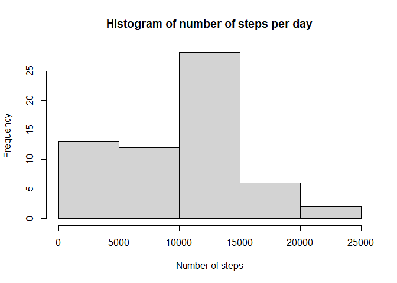
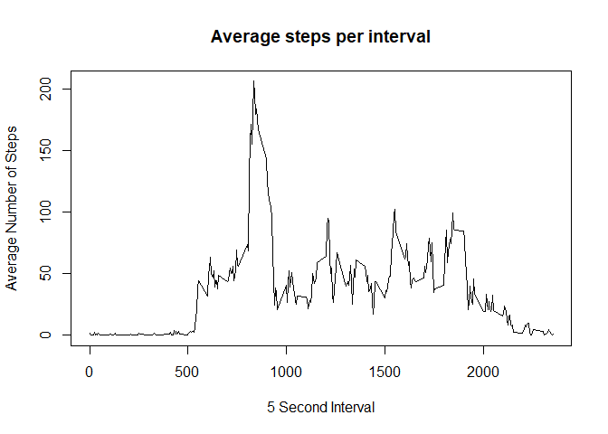
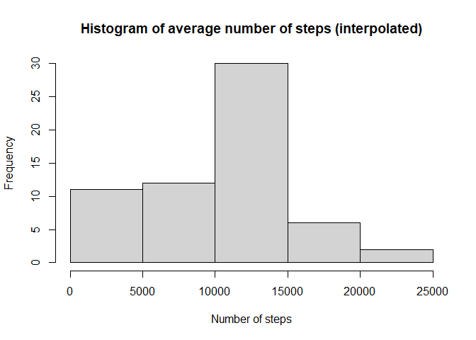
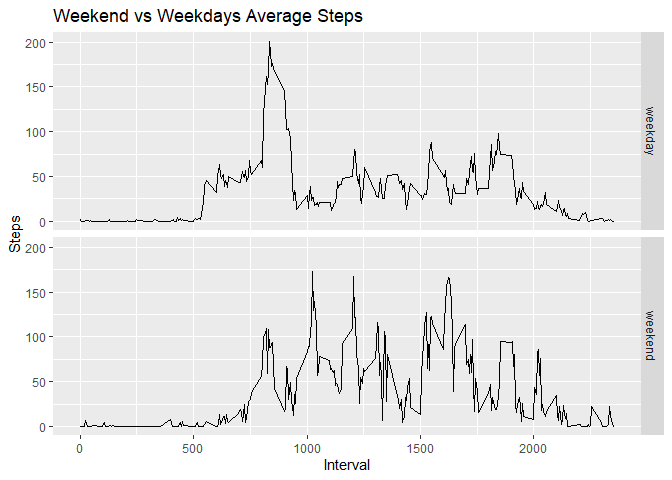

## Loading and preprocessing the data
The following code is used to load the data into the system

```r
library(lubridate)
```

```
## 
## Attaching package: 'lubridate'
```

```
## The following objects are masked from 'package:base':
## 
##     date, intersect, setdiff, union
```

```r
library(dplyr)
```

```
## 
## Attaching package: 'dplyr'
```

```
## The following objects are masked from 'package:stats':
## 
##     filter, lag
```

```
## The following objects are masked from 'package:base':
## 
##     intersect, setdiff, setequal, union
```

```r
library(ggplot2)
unzip("activity.zip")
AMdata<-read.csv("activity.csv")
```

The following code transforms the data

```r
AMdata$date<-ymd(AMdata$date)
```

## What is mean total number of steps taken per day?
The following code finds the average value of steps. There are NA values so they need
to be removed. 

```r
Steptotal<-tapply(AMdata$step, AMdata$date, sum,na.rm=T)
hist(Steptotal,xlab = "Number of steps",main = "Histogram of number of steps per day")
```

<!-- -->

```r
Stepmean<-mean(Steptotal,na.rm=T)
print(Stepmean)
```

```
## [1] 9354.23
```

```r
Stepmed<-median(Steptotal,na.rm=T)
print(Stepmed)
```

```
## [1] 10395
```

## What is the average daily activity pattern?
The following code finds the average number of steps across each 5 minute time
interval. The interval with the representing the maximum value can then be found.


```r
Stepint<-tapply(AMdata$step, AMdata$interval, mean,na.rm=T)
plot(AMdata$interval[1:length(Stepint)],Stepint,type = "l",xlab = "5 Second Interval",ylab = "Average Number of Steps",main = "Average steps per interval")
```

<!-- -->

```r
Max<-max(Stepint)
Intmax<-Stepint[Stepint==Max]
print(Intmax)
```

```
##      835 
## 206.1698
```
## Imputing missing values
The number of NA values is found similpy with the following:

```r
Natot<-sum(is.na(AMdata$steps))
print(Natot)
```

```
## [1] 2304
```

The zoo library contains some functions that facilitate the interpolation of 
missing data. This code uses the na approx function to find the approximate values
from linear approximation and saves the values in a second dataframe. 

```r
library(zoo)
```

```
## 
## Attaching package: 'zoo'
```

```
## The following objects are masked from 'package:base':
## 
##     as.Date, as.Date.numeric
```

```r
DF2<-AMdata
DF2$steps<-na.approx.default(AMdata$steps,na.rm = F)
Natot<-sum(is.na(DF2))
print(Natot)
```

```
## [1] 576
```

There still remains some NA values. This code will fill in any remain NA values 
with the average values for that interval (Stepint). The average value vector is
repeated so the comparision is of equal dimensions. 

```r
repStepint<-rep(Stepint,nrow(AMdata)/nrow(Stepint))
DF2[is.na(DF2)]<-repStepint[is.na(DF2)]
Natot<-sum(is.na(DF2))
print(Natot)
```

```
## [1] 0
```

This code will plot the new dataframe with the interpolated values.

```r
Steptotalnew<-tapply(DF2$step, DF2$date, sum)
hist(Steptotalnew,xlab = "Number of steps",main = "Histogram of average number of steps (interpolated)")
```

<!-- -->

The median and mean for the new dataframe are then calulated.

```r
Stepmeannew<-mean(Steptotalnew)
print(Stepmeannew)
```

```
## [1] 9707.219
```

```r
Stepmednew<-median(Steptotalnew)
print(Stepmednew)
```

```
## [1] 10571
```

The following compares the mean and median of the two datasets

```r
permean<-abs(Stepmean-Stepmeannew)/Stepmean*100
print(permean)
```

```
## [1] 3.773585
```

```r
permed<-abs(Stepmed-Stepmednew)/Stepmed*100
print(permed)
```

```
## [1] 1.693122
```

The differences between means is 3.8% and the difference in medians is 1.7%.
The impact of inputting missing data is very small.

## Are there differences in activity patterns between weekdays and weekends?
This code will add the day of the week to the second data frame and then sort
it by weekday or weekend. 

```r
DF2<-mutate(DF2,Day=weekdays(DF2$date))
DF2$Day[DF2$Day=="Sunday"|DF2$Day=="Satday"]<-"weekend"
DF2$Day[!DF2$Day=="weekend"]<-"weekday"
```

The following codes takes the mean of the steps by the factors of both the day 
(being the weekend or weekday) and the interval. The mean is than plotted against
these factors.

```r
Valmean<-aggregate(steps~ Day + interval, data=DF2,mean)
g<-ggplot(data = Valmean,aes(x=interval,y=steps))
g+geom_line()+labs(y="Steps",x="Interval",title = "Weekend vs Weekdays Average Steps")+facet_grid(Day~.)
```

<!-- -->
